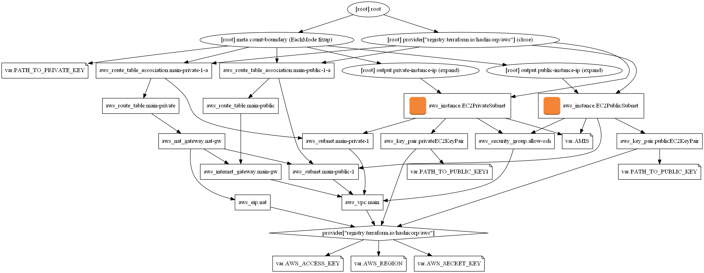

# Terraform Testing Project


## Table of Contents

- [Terraform Testing Project](#terraform-testing-project)
  - [Table of Contents](#table-of-contents)
  - [About](#about)
  - [Getting Started](#getting-started)
    - [Pre-requisites](#pre-requisites)
    - [Installation](#installation)
  - [Usage](#usage)
  - [Weekly Assignment 7](#weekly-assignment-7)

## About

This project contains Terraform scripts to build demo architecture in AWS. All the commits contains all of the demo architecture from the master branch. This repository follows ["Learn DevOps: Infrastructure Automation With Terraform"](https://www.udemy.com/course/learn-devops-infrastructure-automation-with-terraform/) Udemy Course. The `weekly-assignment-7` branch contains the assignment from Nick.

## Getting Started

Documentation is available on the [Terraform website](https://www.terraform.io/docs/index.html):


### Pre-requisites

Required to have an AWS IAM User Credentials and store at `terraform.tfvars` in the working directory.
<b>NEVER PUSH YOUR AWS CREDENTIALS TO GITHUB!</b>
```
AWS_ACCESS_KEY = "<YOUR ACCESS KEY>"
AWS_SECRET_KEY = "<YOUR SECRET KEY>"
AWS_REGION = "<YOUR AWS REGION>"
```


### Installation

The installation process can be found in the [Terraform official documentation](https://learn.hashicorp.com/tutorials/terraform/install-cli).

## Usage

Run these commands to create the infrastructure:
```
terraform init # Initialize a working directory containing Terraform config files
terraform apply # Apply the changes required to reach the desired state of the configuration
```

Run this command to destroy the infrastructure built by Terraform:
```
terraform destroy
```
<br>

## Weekly Assignment 7
For the weekly assignment 7, I have created:
* 1x VPC
* 1x Public and Private Subnet
* 1x NAT Gateway
* 1x Internet Gateway
* 1x Linux EC2 Instance in Public Subnet
* 1x Linux EC2 Instance in Private Subnet

You can access your EC2 Instance in the private subnet by following this [blog](https://aws.amazon.com/blogs/security/securely-connect-to-linux-instances-running-in-a-private-amazon-vpc/).

Below is the architecture that I have drawn by using the `graphviz` library:

